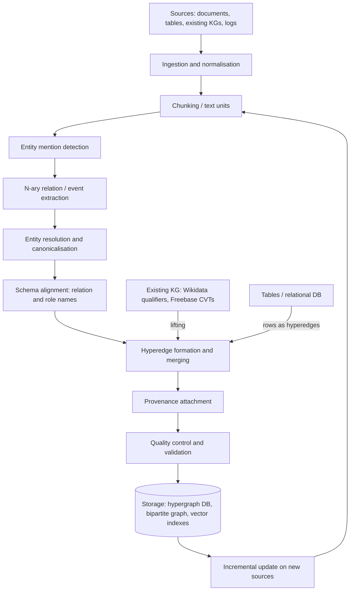

# Knowledge hypergraph construction pipeline — end-to-end overview

This note gives the reference pipeline for building a knowledge hypergraph (KHG) — a set of entities plus
*hyperedges* that each connect two or more entities to express one n-ary fact — and links to the focused
notes in this section that treat each stage. The pipeline is a synthesis: no single system implements every
stage, and the individual stages come from different research communities (event extraction, knowledge
graph completion, database theory, LLM-based RAG). Where a stage is described from a specific system,
it is cited.

## Why a KHG pipeline differs from a KG pipeline

In a binary knowledge graph the unit of extraction is a triple `(s, r, o)`. In a KHG the unit is a fact with
an arbitrary number of participants. [Fatemi et al., 2020](https://arxiv.org/abs/1906.00137) define the
target formally: "A world consists of a finite set of entities E, a finite set of relations R, and a set of
tuples τ where each tuple in τ is of the form r(e1, e2, . . . , ek)", and "A knowledge hypergraph consists of a
subset of" those tuples. Four concrete schemas for such facts are in use (hyper-relational, event-based,
role-based, hypergraph-based; see [Luo et al., 2024](https://arxiv.org/abs/2310.05185) and the
[schema note](schema-induction-and-ontology-alignment.md)). The choice of schema decides what the extractor
must output and therefore shapes every downstream stage.

Three consequences follow for construction:

1. **Extraction must group participants into one fact**, not merely find pairwise links. Document-level and
   cross-sentence extraction become necessary because the participants of one n-ary fact are frequently
   spread over several sentences — DocRED reports that "at least 40.7% relational facts can only be
   extracted from multiple sentences" ([Yao et al., 2019](https://arxiv.org/abs/1906.06127)), and the
   drug–gene–mutation work of [Peng et al., 2017](https://arxiv.org/abs/1708.03743) exists precisely because
   ternary facts rarely sit inside a single sentence.
2. **Roles matter.** A hyperedge with participants {A, B, C} is under-specified unless each participant's
   role (or position) is known. Role-based and hyper-relational schemas make roles explicit; the plain
   hypergraph schema relies on argument order or on a natural-language description of the hyperedge
   (as in HyperGraphRAG, [Luo et al., 2025](https://arxiv.org/abs/2503.21322)).
3. **Deduplication is harder.** Two extractions of the same n-ary fact may differ in arity (one mentions
   the date, the other does not), so equality of hyperedges is not the right merge criterion; see
   [entity resolution](entity-resolution-and-canonicalisation.md).

## Reference pipeline

### Stage 1 — Ingestion and chunking

LLM-based systems chunk text by token count. The two open-source KHG-RAG systems inspect for this note
both use 1200-token chunks with 100-token overlap: HyperGraphRAG's class defaults are
`chunk_token_size: int = 1200` and `chunk_overlap_token_size: int = 100`
([HyperGraphRAG repository](https://github.com/LHRLAB/HyperGraphRAG), `hypergraphrag/hypergraphrag.py`,
checked 2026-09-19), and Hyper-RAG reports "fixed-size chunks of 1200 tokens, with an overlapping segment of
100 tokens between consecutive chunks" ([Feng et al., 2025](https://arxiv.org/abs/2504.08758)). Chunk size
is not neutral: GraphRAG measured that its extractor "extracted almost twice as many entity references when
the chunk size was 600 tokens than when it was 2400" ([Edge et al., 2024](https://arxiv.org/abs/2404.16130)),
and compensated with "gleaning" rounds (see stage 3). Chunks are kept as first-class objects because they are
the provenance anchor: GraphRAG's "TextUnits are also referenced by extracted knowledge items, providing
provenance back to the original source text"
([GraphRAG indexing dataflow](https://microsoft.github.io/graphrag/index/default_dataflow/)).

### Stage 2 — Entity mention detection

Either a classical NER/entity-linking stack (see [entity resolution](entity-resolution-and-canonicalisation.md))
or the LLM emits entities together with the facts. In HyperGraphRAG the LLM emits, per entity, a name, type,
description and a "key score" in (0, 100]; in Hyper-RAG the prompt asks for `entity_name, entity_type,
entity_description, additional_properties` ([Feng et al., 2025](https://arxiv.org/abs/2504.08758)).

### Stage 3 — N-ary relation / event extraction

Three families exist; they are compared in
[n-ary relation extraction from text](n-ary-relation-extraction-from-text.md):

- **Closed-schema event extraction** (ACE 2005, PropBank/FrameNet-style semantic roles): fixed event types
  with typed argument roles.
- **Fine-grained supervised n-ary RE**: Text2NKG classifies span-tuples and merges outputs into facts of any
  arity ([Luo et al., 2024](https://arxiv.org/abs/2310.05185)); CubeRE fills a cube of triple × qualifier
  decisions ([Chia et al., 2022](https://arxiv.org/abs/2211.10018)).
- **Open, LLM-prompted extraction**: the model segments text into "knowledge fragments", each becoming a
  hyperedge described in natural language ([Luo et al., 2025](https://arxiv.org/abs/2503.21322)); or it
  emits pairwise "low-order" and set-valued "high-order" correlations
  ([Feng et al., 2025](https://arxiv.org/abs/2504.08758)). A *gleaning* loop re-prompts the model — "MANY
  knowledge fragments with entities were missed in the last extraction. Add them below using the same
  format:" (HyperGraphRAG `prompt.py`) — up to `entity_extract_max_gleaning: int = 2` times by default.

### Stage 4 — Entity resolution and canonicalisation

Merging mentions into entities. Current KHG-RAG code does this by exact string match on a normalised name
(`entity_name = clean_str(record_attributes[1].upper())` in HyperGraphRAG's `operate.py`), which is cheap
but conflates homonyms and splits synonyms. Alternatives — entity linking to Wikidata/UMLS, embedding-based
clustering, Open-KB canonicalisation — are surveyed in
[entity resolution and canonicalisation](entity-resolution-and-canonicalisation.md).

### Stage 5 — Schema alignment

Deciding the vocabulary of relation and role names: closed (a given ontology), open (whatever the extractor
emits), or induced-then-canonicalised (Extract–Define–Canonicalize, [Zhang & Soh, 2024](https://arxiv.org/abs/2404.03868);
AutoSchemaKG, [Bai et al., 2025](https://arxiv.org/abs/2505.23628)). See
[schema induction and ontology alignment](schema-induction-and-ontology-alignment.md).

### Stage 6 — Hyperedge formation, merging and storage

Hyperedges are formed either directly (a tuple of entity ids with attributes, as in Hypergraph-DB's
`add_e(tuple_of_vertex_ids, attributes)`; [Hypergraph-DB repository](https://github.com/iMoonLab/Hypergraph-DB))
or via a **bipartite transformation** that lets an ordinary graph database hold the hypergraph: HyperGraphRAG
stores `G_B = (V_B, E_B)` with `V_B = V ∪ E_H` and `E_B = {(e_H, v) | e_H ∈ E_H, v ∈ V_{e_H}}`
([Luo et al., 2025](https://arxiv.org/abs/2503.21322)); in code the hyperedge node id is the string
`"<hyperedge>" + knowledge_fragment` and every participant is linked by `upsert_edge(hyper_relation,
entity_name, edge_data=dict(weight=weight, source_id=source_id))`. Repeated observations of the same entity
are merged by concatenating descriptions and, above a token budget, summarising them with the LLM
(`_handle_entity_relation_summary`). Storage formats themselves belong to section 04.

### Stage 7 — Provenance attachment

Every entity and hyperedge should carry the ids of the chunks it came from. HyperGraphRAG and Hyper-RAG keep
a `source_id` field per node and per incidence and concatenate ids on merge (`GRAPH_FIELD_SEP`); GraphRAG
requires answers to cite "[Data: dataset name (record ids)]" ([Edge et al., 2024](https://arxiv.org/abs/2404.16130)).
Wikidata models provenance at the statement level: a statement "may consist of one property … one value …
optionally one or more qualifiers … optionally one or more references"
([Wikibase DataModel Primer](https://www.mediawiki.org/wiki/Wikibase/DataModel/Primer)). Provenance is
what later makes deletion, re-indexing and auditing possible (see
[incremental construction](incremental-and-streaming-construction.md)).

### Stage 8 — Quality control

Constraint checking (Wikidata property constraints), LLM- or human-verification of extracted facts, and
consistency checks. Covered in [curation and quality](curation-crowdsourcing-and-quality.md) and
[evaluation](evaluation-of-constructed-khgs.md).

### Stage 9 — Incremental update

Union of node and hyperedge sets with re-summarisation of touched elements (LightRAG's approach:
"combines the new graph data with the original by taking the union of the node sets and edge sets",
[Guo et al., 2024](https://arxiv.org/abs/2410.05779)), or anchor-based local refinement (Hyper-M2RAG,
[Chen et al., 2026](https://arxiv.org/abs/2608.16628)). See
[incremental and streaming construction](incremental-and-streaming-construction.md).

## Alternative entry points

Not every KHG starts from text:

- **Lifting an existing KG.** Wikidata statements with qualifiers and Freebase compound value types are
  already n-ary; the datasets WD50K, WikiPeople, JF17K and FB-AUTO were all built this way. See
  [from knowledge graphs to hypergraphs](from-knowledge-graphs-to-hypergraphs.md).
- **Relational tables and set-valued data.** A table row is naturally a hyperedge over the values it joins;
  co-authorship, co-purchase and tagging data give hypergraphs directly. See
  [hypergraph construction from data](hypergraph-construction-from-data.md), which also discusses when such
  a hypergraph deserves the label "knowledge".
- **Manual curation.** Community-edited KBs (Wikidata) and expert-built ones (Cyc). See
  [curation](curation-crowdsourcing-and-quality.md).

## Costs and scale (indicative, 2025)

HyperGraphRAG reports construction cost of "3.084 s per 1k tokens, $0.0063 per 1k tokens" against 9.272 s
for GraphRAG and 2.758 s for HippoRAG2 under its setup ([Luo et al., 2025](https://arxiv.org/abs/2503.21322));
its corpora ranged from 122k to 940k tokens and yielded, e.g., 19,913 entities and 26,902 hyperedges for the
computer-science corpus. AutoSchemaKG, a binary+event KG rather than a KHG, shows what web scale looks like
with LLM extraction: "900+ million nodes and 5.9 billion edges" from more than 50 million documents
([Bai et al., 2025](https://arxiv.org/abs/2505.23628)). No published KHG-from-text pipeline at that scale
was found during this research run.

## Status of the field (opinion)

The classical stages (event extraction, entity linking, canonicalisation, constraint checking) are mature
for binary and closed-schema settings. The KHG-specific pieces — open-schema n-ary extraction, merging
hyperedges of different arity, role canonicalisation, evaluation of hyperedge quality — are active research
with few shared benchmarks (HyperRED and its Text2NKG extension being the main ones). LLM-based pipelines
have made KHG construction cheap enough to try on any corpus, but they currently skip most of stages 4, 5
and 8.

## Sources

- Fatemi, B., Taslakian, P., Vazquez, D., Poole, D. "Knowledge Hypergraphs: Prediction Beyond Binary Relations." IJCAI 2020 / arXiv 1906.00137 (2019, v3 2020). https://arxiv.org/abs/1906.00137
- Luo, H., E, H., Yang, Y., Yao, T., et al. "Text2NKG: Fine-Grained N-ary Relation Extraction for N-ary relational Knowledge Graph Construction." NeurIPS 2024 / arXiv 2310.05185. https://arxiv.org/abs/2310.05185
- Yao, Y., Ye, D., Li, P., Han, X., et al. "DocRED: A Large-Scale Document-Level Relation Extraction Dataset." ACL 2019 / arXiv 1906.06127. https://arxiv.org/abs/1906.06127
- Peng, N., Poon, H., Quirk, C., Toutanova, K., Yih, W. "Cross-Sentence N-ary Relation Extraction with Graph LSTMs." TACL 5, 2017. https://arxiv.org/abs/1708.03743
- Luo, H., E, H., Chen, G., Zheng, Y., et al. "HyperGraphRAG: Retrieval-Augmented Generation via Hypergraph-Structured Knowledge Representation." NeurIPS 2025 / arXiv 2503.21322. https://arxiv.org/abs/2503.21322
- LHRLAB. HyperGraphRAG repository (files `hypergraphrag/hypergraphrag.py`, `operate.py`, `prompt.py`), checked 2026-09-19. https://github.com/LHRLAB/HyperGraphRAG
- Feng, Y., Hu, H., Hou, X., Liu, S., et al. "Hyper-RAG: Combating LLM Hallucinations using Hypergraph-Driven Retrieval-Augmented Generation." arXiv:2504.08758, 30 Mar 2025; *Nature Communications* 17(1):5778, 27 Apr 2026. https://arxiv.org/abs/2504.08758 ; https://doi.org/10.1038/s41467-026-71411-1
- iMoonLab. Hypergraph-DB repository, checked 2026-09-19. https://github.com/iMoonLab/Hypergraph-DB
- Edge, D., Trinh, H., Cheng, N., Bradley, J., et al. "From Local to Global: A Graph RAG Approach to Query-Focused Summarization." arXiv 2404.16130, 2024 (rev. 2025). https://arxiv.org/abs/2404.16130
- Microsoft. GraphRAG documentation, "Indexing Dataflow", checked 2026-09-19. https://microsoft.github.io/graphrag/index/default_dataflow/
- Guo, Z., Xia, L., Yu, Y., Ao, T., Huang, C. "LightRAG: Simple and Fast Retrieval-Augmented Generation." arXiv 2410.05779, 2024 (rev. 2025). https://arxiv.org/abs/2410.05779
- Chia, Y. K., Bing, L., Aljunied, S. M., Si, L., Poria, S. "A Dataset for Hyper-Relational Extraction and a Cube-Filling Approach." EMNLP 2022 / arXiv 2211.10018. https://arxiv.org/abs/2211.10018
- Zhang, B., Soh, H. "Extract, Define, Canonicalize: An LLM-based Framework for Knowledge Graph Construction." EMNLP 2024 / arXiv 2404.03868. https://arxiv.org/abs/2404.03868
- Bai, J., et al. "AutoSchemaKG: Autonomous Knowledge Graph Construction through Dynamic Schema Induction from Web-Scale Corpora." arXiv 2505.23628, 2025. https://arxiv.org/abs/2505.23628
- Chen, S., Xu, Y., Han, X., Xue, R., et al. "Hypergraph-based Multimodal Retrieval-Augmented Generation with Incremental Refinement." ACM MM 2026 / arXiv 2608.16628. https://arxiv.org/abs/2608.16628
- Wikimedia. "Wikibase/DataModel/Primer", checked 2026-09-19. https://www.mediawiki.org/wiki/Wikibase/DataModel/Primer
