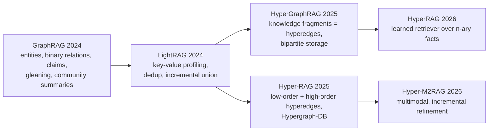

# LLM-based knowledge hypergraph construction

Since 2024 the fastest-growing way to build a knowledge hypergraph is to prompt a large language model to
emit entities and n-ary facts from text chunks, store them in a hypergraph (or a bipartite graph standing in
for one) plus vector indexes, and use the result for retrieval-augmented generation (RAG). This note
describes the two open-source systems whose code was inspected (HyperGraphRAG, Hyper-RAG), the binary-graph
systems they descend from (GraphRAG, LightRAG), the 2026 follow-ups, and the recurring design choices:
schema-free vs schema-guided prompts, gleaning, merging, verification and cost. All model names are omitted
here; the papers name the commercial models they used.

## 1. Lineage



HyperGraphRAG's and Hyper-RAG's code bases share LightRAG's structure (`operate.py` with
`chunking_by_token_size`, `extract_entities`, `_merge_nodes_then_upsert`, `_merge_edges_then_upsert`,
`GRAPH_FIELD_SEP`, `compute_mdhash_id` with `ent-`/`rel-` prefixes), which is visible in both repositories
([HyperGraphRAG](https://github.com/LHRLAB/HyperGraphRAG), [Hyper-RAG](https://github.com/iMoonLab/Hyper-RAG),
both checked 2026-09-19).

## 2. The binary baselines: what they extract and how

**GraphRAG** ([Edge et al., 2024](https://arxiv.org/abs/2404.16130)) prompts the LLM per text chunk for
entities ("entity_name: Name of the entity, capitalized", type, description), relationships between pairs
that are "clearly related" (with "relationship_description: explanation as to why you think the source
entity and the target entity are related" and a strength score), and claims ("factual statements about
entities, such as dates, events, and interactions with other entities"). Because smaller chunks extract more
("almost twice as many entity references when the chunk size was 600 tokens than when it was 2400"), it
adds *gleaning*: after a first pass the model is asked whether entities were missed, "a logit bias of 100 to
force a yes/no decision", then prompted to continue; this "allows us to use larger chunk sizes without a drop
in quality". Descriptions are "aggregated and summarized for each node and edge", and "the number of
duplicates for a given relationship becomes edge weights". The indexing dataflow documents provenance:
TextUnits "are also referenced by extracted knowledge items"
([GraphRAG docs](https://microsoft.github.io/graphrag/index/default_dataflow/)).

**LightRAG** ([Guo et al., 2024](https://arxiv.org/abs/2410.05779)) keeps the extraction step but replaces
community summaries with key–value *profiles* ("Each index key is a word or short phrase that enables
efficient retrieval, while the corresponding value is a text paragraph summarizing relevant snippets"), adds a
deduplication function that "identifies and merges identical entities and relations from different segments of
the raw text", and an incremental update that "combines the new graph data with the original by taking the
union of the node sets and edge sets".

Neither produces hyperedges: a fact with three or more participants becomes several pairwise edges, with the
grouping lost.

## 3. HyperGraphRAG (2025): knowledge fragments as hyperedges

[Luo et al., 2025](https://arxiv.org/abs/2503.21322) (NeurIPS 2025) define a knowledge hypergraph
`G_H = (V, E_H)` where each hyperedge "consists of two parts: a natural language description" and "a
confidence score" in 0–10, and each entity carries "entity name …, type …, explanation …, and confidence score
∈ (0,100]".

**Prompt.** The extraction prompt (`hypergraphrag/prompt.py`) asks the model to divide the text into
complete knowledge segments, score their completeness 0–10, list all entities with descriptions and a 0–100
importance score, in a delimited record format:

```
("hyper-relation"<|><knowledge_segment><|><completeness_score>)##
("entity"<|><entity_name><|><entity_type><|><entity_description><|><key_score>)##
...<|COMPLETE|>
```

Gleaning uses the prompt "MANY knowledge fragments with entities were missed in the last extraction. Add them
below using the same format:", up to `entity_extract_max_gleaning: int = 2`. A summarisation prompt asks to
"concatenate all of these into a single, comprehensive description" of an entity when merged descriptions
exceed a token budget.

**Schema.** Schema-free: the hyperedge is the knowledge segment text itself. Roles are implicit in the
sentence; the entity list attached to a fragment is the hyperedge's vertex set. This is the "hypergraph-based
schema" `(r, {v_i})` of Text2NKG with `r` replaced by free text.

**Storage.** A bipartite transformation `V_B = V ∪ E_H`, `E_B = {(e_H, v)}` so that "an ordinary graph
database" can hold it; in code each hyperedge is a node whose id is `"<hyperedge>" + knowledge_fragment` and
each participant is linked with `upsert_edge(hyper_relation, entity_name, edge_data=dict(weight=weight,
source_id=source_id))`. Defaults are `JsonKVStorage`, `NanoVectorDBStorage` and `NetworkXStorage`, with
Neo4j, Milvus, Chroma, MongoDB, Oracle and TiDB backends available. Two vector indexes are kept: entities
(content = name + description, id prefix `ent-`) and hyperedges (content = fragment text, id prefix `rel-`).

**Entity merging.** Exact match on `clean_str(record_attributes[1].upper())`. No embedding- or
LLM-based merging. Merged nodes take the most frequent type and concatenated descriptions/source ids.

**Retrieval.** Entity retrieval `argmax sim(h_q, h_v) ⊙ v_score > τ_V`, hyperedge retrieval
`argmax sim(h_q, h_eH) ⊙ eH_score > τ_H`, then bidirectional expansion over the bipartite graph.

**Data and results.** Corpora of 179k (medicine), 382k (agriculture), 795k (computer science), 940k (legal)
and 122k (mixed) knowledge tokens; hypergraphs of e.g. 19,913 entities / 26,902 hyperedges (CS) and
11,098 / 18,285 (legal). Metrics: word-level F1, retrieval similarity (R-S) and an LLM-judged generation
score (G-E). Construction cost "3.084 s per 1k tokens, $0.0063 per 1k tokens" versus 9.272 s for GraphRAG.
Question–answer pairs for evaluation were "manually verified to ensure factual accuracy, relevance, and
diversity"; no hallucination rate for the extracted hyperedges is reported.

## 4. Hyper-RAG (2025): low-order and high-order correlations

[Feng et al., 2025](https://arxiv.org/abs/2504.08758) extract, per chunk, entities
(`entity_name, entity_type, entity_description, additional_properties`), then two kinds of hyperedges:

- **Low-order**: "all pairs of (source_entity, target_entity) that are *clearly related*" with
  `low_order_relationship_description, …_keywords, …_strength` — essentially LightRAG's binary edges;
- **High-order**: the model is asked to "find connections among multiple entities and construct high-order
  associated entity sets", each with a description, a *generalisation* (conceptual summary), keywords and
  strength.

The record format in `hyperrag/prompt.py` is
`("High-order Hyperedge" | <entities> | <description> | <generalization> | <keywords> | <strength>)`, with
`" | "` as tuple delimiter and `<|COMPLETE|>` as terminator. Entity types are drawn from
`organization, person, geo, event, role, concept`. Merging follows LightRAG (descriptions concatenated with
`GRAPH_FIELD_SEP`, summarised beyond `entity_summary_to_max_tokens` = 500; hyperedge weights summed).

**Storage.** A native hypergraph store, Hypergraph-DB, whose hyperedges are "tuples of vertex ids" with
attribute dictionaries and whose API includes `add_v`, `add_e`, `nbr_e_of_v`, `degree_v/degree_e`, with
pickle (`.hgdb`) and HIF JSON persistence ([Hypergraph-DB repository](https://github.com/iMoonLab/Hypergraph-DB)).
Entity and relation vector databases are kept alongside.

**Data and results.** NeurologyCorp (about 1.97M tokens); "approximately 4,000 high-order and 13,000
low-order correlations were extracted" from the prior corpus described in the paper; an average retrieval
time of 0.723 s (Hyper-RAG) vs 2.83 s (GraphRAG), 0.676 s (LightRAG); Hyper-RAG-Lite "achieved a twofold
increase in retrieval speed and a 3.3% performance improvement over Light RAG". Evaluation is LLM-judged
(five-dimension scoring and pairwise selection) rather than fact-level.

**Reproduction scripts.** `reproduce/Step_0.py`–`Step_3.py`: preprocess, "build knowledge hypergraphs, and
entity and relation vector database", extract questions, generate answers ([Hyper-RAG repository](https://github.com/iMoonLab/Hyper-RAG)).

## 5. 2026 follow-ups

- **HyperRAG** ([Lien et al., 2026](https://arxiv.org/html/2602.14470v1)) assumes a hypergraph of n-ary
  facts already exists and trains a *HyperRetriever* that scores plausibility with structural and semantic
  embeddings, allocating the context budget "50% for hyperedges, 30% for entities, and 20% for source
  chunks". It reports MRR 36.94% vs HyperGraphRAG's 35.88% on WikiTopics-CLQA. Construction is out of
  scope for that paper — a sign that construction and retrieval are decoupling.
- **Hyper-M2RAG** ([Chen et al., 2026](https://arxiv.org/abs/2608.16628), ACM MM 2026) extends Hyper-RAG
  to page-level multimodal units (OCR text, page image, figure/table patches), extracts entities and
  low/high-order hyperedges per page, then performs *incremental refinement* around "cross-page anchors"
  (entities whose provenance count exceeds a threshold) by rebuilding their star-expansion neighbourhood
  instead of reprocessing pages. It reports far more high-order hyperedges than text-only Hyper-RAG
  (8,257 vs 2,579 on TechReport).
- **Order-aware hypergraph RAG** ([Wu et al., 2026](https://arxiv.org/abs/2604.12185)) augments the
  hypergraph with precedence structure learned "without requiring explicit temporal supervision".

## 6. Design choices that recur

| Choice | GraphRAG | LightRAG | HyperGraphRAG | Hyper-RAG |
|---|---|---|---|---|
| Chunk size (tokens) | 600–2400 tested | LightRAG default | 1200 / overlap 100 | 1200 / overlap 100 |
| Unit of fact | binary edge + claims | binary edge | knowledge fragment (n-ary) | pair + entity set |
| Schema | open, typed entities | open | open, free-text hyperedge | open, 6 entity types |
| Gleaning | yes (logit-biased yes/no) | yes | yes, max 2 | yes |
| Entity merge | exact name | exact name | exact upper-cased name | exact name |
| Hyperedge merge | edge weight = duplicates | dedup identical | same fragment string | same vertex tuple, weights summed |
| Storage | graph + community reports | graph + KV | bipartite graph + 2 vector DBs | Hypergraph-DB + 2 vector DBs |
| Fact verification | none | none | none | none |

**Schema-guided vs schema-free.** All four are schema-free. Schema-guided alternatives exist outside RAG:
SPIRES/OntoGPT constrains output to a LinkML schema and grounds "all matched elements" to ontology
identifiers, with accuracy "comparable to the mid-range of existing Relation Extraction (RE) methods" but
zero training data ([Caufield et al., 2024](https://arxiv.org/abs/2304.02711)); Text2KGBench measures
"fact extraction performance, ontology conformance, and hallucinations" for ontology-driven generation
([Mihindukulasooriya et al., 2023](https://arxiv.org/abs/2308.02357)). See the
[schema note](schema-induction-and-ontology-alignment.md).

**Prompt engineering.** Automatic prompt optimisation "can generate reasonable prompts similar to humans for
triple extraction", with the largest gains "with increasing schema complexity and text size"
([Mihindukulasooriya et al., 2025](https://arxiv.org/abs/2506.19773)); HKG-MLLM applies the idea to
hyper-relational extraction on HyperRED with an added correction module
([Zhu et al., 2026](https://link.springer.com/article/10.1007/s40747-026-02475-1)).

**Hallucination and verification.** The hypergraph RAG papers evaluate answers, not hyperedges. The
evidence from adjacent work is cautionary: on hyper-relational extraction zero-shot prompting gives recall
0.77 with lower precision ([Datta et al., 2024](https://arxiv.org/abs/2403.11786)); a broad study concludes
LLMs "are more suited as inference assistants rather than few-shot information extractors"
([Zhu et al., 2023/2024](https://arxiv.org/abs/2305.13168)). Multi-agent pipelines add explicit checks:
KARMA runs "nine collaborative agents, spanning entity discovery, relation extraction, schema alignment, and
conflict resolution" and reports "83.1% LLM-verified correctness" on 1,200 PubMed articles
([Lu et al., 2025](https://arxiv.org/abs/2502.06472)); a clinical pipeline scores each triple by
self-consistency across prompts, grounding to SNOMED CT/LOINC/RxNorm and an LLM-as-judge plausibility score
([Das et al., 2026](https://arxiv.org/html/2601.01844v1)). None of these is yet integrated in a KHG-RAG
construction loop.

**Cost.** Construction is LLM-bound: HyperGraphRAG's $0.0063 per 1k tokens implies roughly $6 per million
input tokens of corpus at 2025 prices, before gleaning retries; retrieval cost differs by orders of magnitude
(GraphRAG's global mode "consumes approximately 610,000 tokens" per query vs "fewer than 100 tokens" for
LightRAG keyword generation, per [Guo et al., 2024](https://arxiv.org/abs/2410.05779)).

## 7. Assessment (opinion)

These systems prove that hyperedges can be extracted cheaply and that retrieval over them helps QA in
several domains. As *knowledge hypergraph construction* they are thin: hyperedges are unnormalised text,
roles are implicit, entities merge only on exact names, and no fact is verified. The obvious next steps —
plug in Text2NKG-style typed n-ary extraction, an entity linker, and a verification agent — are each
available in isolation but have not been combined in a published hypergraph RAG system as of this run.

## Sources

- Edge, D., Trinh, H., Cheng, N., Bradley, J., et al. "From Local to Global: A Graph RAG Approach to Query-Focused Summarization." arXiv 2404.16130, 2024 (rev. 2025). https://arxiv.org/abs/2404.16130
- Microsoft. GraphRAG documentation, "Indexing Dataflow", checked 2026-09-19. https://microsoft.github.io/graphrag/index/default_dataflow/
- Guo, Z., Xia, L., Yu, Y., Ao, T., Huang, C. "LightRAG: Simple and Fast Retrieval-Augmented Generation." arXiv 2410.05779, 2024 (rev. 2025). https://arxiv.org/abs/2410.05779
- HKUDS. LightRAG repository README, checked 2026-09-19. https://github.com/HKUDS/LightRAG
- Luo, H., E, H., Chen, G., Zheng, Y., et al. "HyperGraphRAG: Retrieval-Augmented Generation via Hypergraph-Structured Knowledge Representation." NeurIPS 2025 / arXiv 2503.21322. https://arxiv.org/abs/2503.21322
- LHRLAB. HyperGraphRAG repository (`hypergraphrag/prompt.py`, `operate.py`, `hypergraphrag.py`), checked 2026-09-19. https://github.com/LHRLAB/HyperGraphRAG
- Feng, Y., Hu, H., Hou, X., Liu, S., Ying, S., Du, S., Hu, H., Gao, Y. "Hyper-RAG: Combating LLM Hallucinations using Hypergraph-Driven Retrieval-Augmented Generation." arXiv:2504.08758, 30 Mar 2025; *Nature Communications* 17(1):5778, 27 Apr 2026. https://arxiv.org/abs/2504.08758 ; https://doi.org/10.1038/s41467-026-71411-1
- iMoonLab. Hyper-RAG repository (`hyperrag/prompt.py`, `operate.py`, `reproduce/Step_1.py`), checked 2026-09-19. https://github.com/iMoonLab/Hyper-RAG
- iMoonLab. Hypergraph-DB repository, checked 2026-09-19. https://github.com/iMoonLab/Hypergraph-DB
- Lien, et al. "HyperRAG: Reasoning N-ary Facts over Hypergraphs for Retrieval Augmented Generation." arXiv 2602.14470, 2026. https://arxiv.org/html/2602.14470v1
- Chen, S., Xu, Y., Han, X., Xue, R., Wu, D., Gao, Y., Yan, C., Gao, Y. "Hypergraph-based Multimodal Retrieval-Augmented Generation with Incremental Refinement." ACM MM 2026 / arXiv 2608.16628. https://arxiv.org/abs/2608.16628
- Wu, K., Kuai, C., Li, Z., Jiang, J., et al. "Knowledge Is Not Static: Order-Aware Hypergraph RAG for Language Models." arXiv 2604.12185, 2026. https://arxiv.org/abs/2604.12185
- Caufield, J. H., Hegde, H., Emonet, V., Harris, N. L., et al. "Structured prompt interrogation and recursive extraction of semantics (SPIRES): A method for populating knowledge bases using zero-shot learning." Bioinformatics 40(3), 2024 / arXiv 2304.02711. https://arxiv.org/abs/2304.02711
- Mihindukulasooriya, N., Tiwari, S., Enguix, C. F., Lata, K. "Text2KGBench: A Benchmark for Ontology-Driven Knowledge Graph Generation from Text." ISWC 2023 / arXiv 2308.02357. https://arxiv.org/abs/2308.02357
- Mihindukulasooriya, N., D'Souza, N. S., Chowdhury, F., Samulowitz, H. "Automatic Prompt Optimization for Knowledge Graph Construction: Insights from an Empirical Study." LLM+Graph Workshop, VLDB 2025 / arXiv 2506.19773. https://arxiv.org/abs/2506.19773
- Zhu, Q., Wei, X., Wang, Q., Yan, Y., Yuan, H., Shen, T. "Multi-LLM collaborative hyper-relational knowledge graph construction with automatic prompt optimization." Complex & Intelligent Systems, 2026. https://link.springer.com/article/10.1007/s40747-026-02475-1
- Datta, P., Vitiugin, F., Chizhikova, A., Sawhney, N. "Construction of Hyper-Relational Knowledge Graphs Using Pre-Trained Large Language Models." arXiv 2403.11786, 2024. https://arxiv.org/abs/2403.11786
- Zhu, Y., Wang, X., Chen, J., Qiao, S., et al. "LLMs for Knowledge Graph Construction and Reasoning: Recent Capabilities and Future Opportunities." World Wide Web Journal / arXiv 2305.13168, 2023 (rev. 2024). https://arxiv.org/abs/2305.13168
- Lu, Y., Wu, W., Zhao, X., Peng, R., Wang, J. "KARMA: Leveraging Multi-Agent LLMs for Automated Knowledge Graph Enrichment." NeurIPS 2025 / arXiv 2502.06472. https://arxiv.org/abs/2502.06472
- Das, U., Atmakuri, K. B., Ho, D., Lee, C., Lee, Y. "Clinical Knowledge Graph Construction and Evaluation with Multi-LLMs via Retrieval-Augmented Generation." arXiv 2601.01844, 2026. https://arxiv.org/html/2601.01844v1
