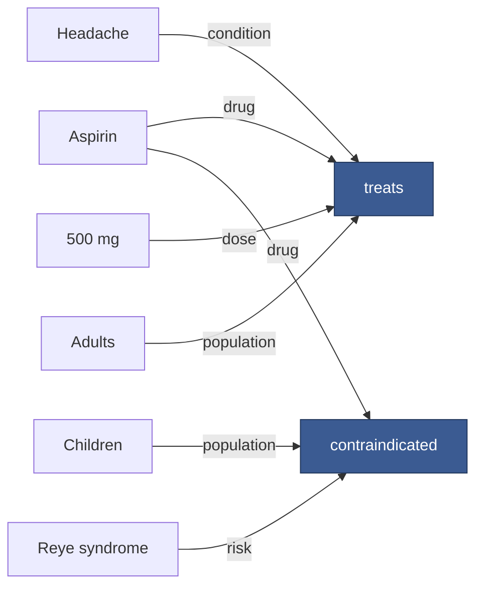

# Visualization cookbook for this knowledge base

Six recipes for drawing a small knowledge hypergraph. **Every snippet in this file was executed on
2026-09-20** in a clean virtual environment and produced output; the console output shown under each
recipe is what the code actually printed.

Environment used:

```
Python 3.11.15
hypernetx 2.4.3      xgi 0.10.2      matplotlib 3.11.2
node 22.22.2         d3 7.9.0        jsdom 30.1.0        mermaid 12.0.0
```

Setup (creates an `out/` directory next to the scripts):

```bash
python3 -m venv venv
./venv/bin/pip install -q --upgrade pip
./venv/bin/pip install -q hypernetx xgi matplotlib
mkdir -p out
```

All recipes use the same toy knowledge hypergraph: five n-ary facts over eleven entities, in a
clinical domain. `treats(Aspirin, Headache, 500 mg, Adults)` is a 4-ary fact, and that is the point —
none of it survives a triple store without reification
([../02-knowledge-representation/n-ary-relations-and-reification.md](../02-knowledge-representation/n-ary-relations-and-reification.md)).

---

## Recipe 1 — HyperNetX: four encodings from one hypergraph

Covers the subset standard (convex hulls), the edge standard (two-column bipartite), a
bipartite-with-Euler variant, and the matrix standard (UpSet).

```python
"""Recipe 1 - HyperNetX: draw a small knowledge hypergraph four ways."""
import matplotlib
matplotlib.use("Agg")                      # headless
import matplotlib.pyplot as plt
import hypernetx as hnx
from hypernetx.drawing import two_column
from hypernetx.drawing.draw_bipartite import draw_bipartite_using_euler

# A knowledge hypergraph: each hyperedge is one n-ary fact.
FACTS = {
    "treats#1":       ["Aspirin", "Headache", "500mg", "Adults"],
    "treats#2":       ["Ibuprofen", "Headache", "400mg", "Adults"],
    "contraindic#1":  ["Aspirin", "Children", "ReyeSyndrome"],
    "interacts#1":    ["Aspirin", "Warfarin", "BleedingRisk"],
    "measured_by#1":  ["Headache", "VAS"],
}
H = hnx.Hypergraph(FACTS)
print("nodes:", len(H.nodes), "edges:", len(H.edges))

fig, ax = plt.subplots(figsize=(7, 5))
hnx.draw(H, ax=ax)                          # subset standard: padded convex hulls
fig.savefig("out/hnx_rubber_band.png", dpi=110, bbox_inches="tight")
plt.close(fig)

fig, ax = plt.subplots(figsize=(5, 5))
two_column.draw(H, ax=ax)                   # edge standard: two-column bipartite
fig.savefig("out/hnx_two_column.png", dpi=110, bbox_inches="tight")
plt.close(fig)

fig, ax = plt.subplots(figsize=(7, 5))
draw_bipartite_using_euler(H, ax=ax)
fig.savefig("out/hnx_bipartite_euler.png", dpi=110, bbox_inches="tight")
plt.close(fig)

fig, ax = plt.subplots(figsize=(7, 5))
hnx.draw_incidence_upset(H, ax=ax)          # matrix standard: UpSet-style incidence
fig.savefig("out/hnx_upset.png", dpi=110, bbox_inches="tight")
plt.close(fig)
print("ok")
```

Output:

```
nodes: 11 edges: 5
ok
```

**Gotchas found while running this.** `hnx.drawing.two_column` and
`hnx.drawing.draw_bipartite.draw_bipartite_using_euler` are **not** re-exported on the top-level
`hypernetx` namespace in 2.4.3 — `hnx.drawing.two_column.draw(...)` raises `AttributeError`. Import
the submodules explicitly, as above. `hnx.draw` and `hnx.draw_incidence_upset` *are* top-level.

`hnx.draw` runs a NetworkX spring layout on the bipartite graph and then pads a
`scipy.spatial.ConvexHull` per hyperedge, so it is the Arafat–Bressan *star* algorithm with a convex
envelope ([hypergraph-drawing-algorithms.md](hypergraph-drawing-algorithms.md), §4.3). Expect hull
overlap above roughly 20 facts.

---

## Recipe 2 — XGI: hulls, bipartite, and a **directed** n-ary fact

XGI is the only Python library found with a first-class directed hypergraph that it will also draw.

```python
"""Recipe 2 - XGI: hull drawing, bipartite drawing, and a directed n-ary fact."""
import matplotlib
matplotlib.use("Agg")
import matplotlib.pyplot as plt
import xgi

FACTS = {
    "treats#1":      ["Aspirin", "Headache", "500mg", "Adults"],
    "treats#2":      ["Ibuprofen", "Headache", "400mg", "Adults"],
    "contraindic#1": ["Aspirin", "Children", "ReyeSyndrome"],
    "interacts#1":   ["Aspirin", "Warfarin", "BleedingRisk"],
    "measured_by#1": ["Headache", "VAS"],
}
H = xgi.Hypergraph(FACTS)
print("XGI", xgi.__version__, "| nodes", H.num_nodes, "| edges", H.num_edges)

pos = xgi.barycenter_spring_layout(H, seed=7)

fig, ax = plt.subplots(figsize=(7, 5))
xgi.draw(H, pos=pos, ax=ax, hull=True, node_labels=True, hyperedge_labels=True)
fig.savefig("out/xgi_hull.png", dpi=110, bbox_inches="tight")
plt.close(fig)

fig, ax = plt.subplots(figsize=(7, 5))
xgi.draw_bipartite(H, ax=ax, node_labels=True, hyperedge_labels=True)
fig.savefig("out/xgi_bipartite.png", dpi=110, bbox_inches="tight")
plt.close(fig)

# Directed hyperedge: (tail set -> head set), the shape a KHG rule needs.
D = xgi.DiHypergraph()
D.add_edge(({"Aspirin", "Warfarin"}, {"BleedingRisk"}), idx="interacts#1")
D.add_edge(({"Aspirin", "Headache"}, {"Relief"}), idx="treats#1")
print("dihypergraph edges:", D.num_edges, "| head of interacts#1:", D.edges.head("interacts#1"))
fig, ax = plt.subplots(figsize=(6, 4))
xgi.draw_bipartite(D, ax=ax, node_labels=True)   # arrows show tail -> edge -> head
fig.savefig("out/xgi_directed.png", dpi=110, bbox_inches="tight")
plt.close(fig)
print("ok")
```

Output:

```
XGI 0.10.2 | nodes 11 | edges 5
dihypergraph edges: 2 | head of interacts#1: {'BleedingRisk'}
ok
```

**Gotchas found while running this.** In XGI 0.10.2 the keyword for an explicit edge identifier is
`idx=`, not `id=` (`DiHypergraph.add_edge(members, idx=None, **attr)`); passing `id=` silently stores
it as an attribute and auto-numbers the edge, after which `D.edges.head("interacts#1")` raises
`IDNotFound`. Also `D.edges.head` is a *method* on `DiEdgeView`, not a dict-like view — call
`D.edges.head(edge_id)`.

For the directed case, `draw_bipartite` draws arrows *into* the square edge marker from every tail
vertex and *out of* it to every head vertex (source comments in `xgi/drawing/draw.py`: "lines going
towards the center" for the tail, "lines going out from the center" for the head). That is exactly
the tail-set → head-set encoding recommended in
[knowledge-hypergraph-specific-visualization.md](knowledge-hypergraph-specific-visualization.md), §6.

---

## Recipe 3 — the recommended encoding, by hand

If you want full control of the four channels this KB recommends (shape = entity vs fact, link label
= role, arrowhead = tail/head, node label = relation type), build the incidence graph yourself. In
Python this is `networkx` plus two node styles; in the browser it is recipe 5. The XGI
`draw_bipartite` call above is the two-minute version; the hand-built version below (recipe 5) is the
one that carries role labels.

---

## Recipe 4 — PAOH-style temporal view in plain matplotlib

No library draws PAOH outside PAOHVis, so here it is in ~40 lines. Vertices are parallel horizontal
bars, each fact is a vertical line inside its time slot, and **role markers** replace the plain dot —
the role channel PAOH introduced
([dynamic-and-temporal-hypergraph-visualization.md](dynamic-and-temporal-hypergraph-visualization.md), §2).

```python
"""Recipe 4 - PAOH-style temporal view of a knowledge hypergraph, in plain matplotlib."""
import matplotlib
matplotlib.use("Agg")
import matplotlib.pyplot as plt

# (fact id, time slot, {vertex: role})
FACTS = [
    ("treats#1",      2019, {"Aspirin": "agent", "Headache": "target", "Adults": "pop"}),
    ("interacts#1",   2019, {"Aspirin": "agent", "Warfarin": "agent", "BleedingRisk": "target"}),
    ("contraindic#1", 2020, {"Aspirin": "agent", "Children": "pop", "ReyeSyndrome": "target"}),
    ("treats#2",      2021, {"Ibuprofen": "agent", "Headache": "target", "Adults": "pop"}),
    ("measured_by#1", 2021, {"Headache": "target", "VAS": "instrument"}),
]
ROLE_MARKER = {"agent": "s", "target": "o", "pop": "^", "instrument": "D"}

# vertex order = first appearance (PAOH's "chronological" ordering)
order, seen = [], set()
for _, _, roles in FACTS:
    for v in roles:
        if v not in seen:
            seen.add(v); order.append(v)
y = {v: i for i, v in enumerate(order)}

slots = sorted({t for _, t, _ in FACTS})
# x position of every fact: packed left to right inside its slot
x, slot_x0, cursor = {}, {}, 0.0
for t in slots:
    slot_x0[t] = cursor
    for fid, ft, _ in FACTS:
        if ft == t:
            cursor += 1.0
            x[fid] = cursor
    cursor += 1.0

fig, ax = plt.subplots(figsize=(8, 4))
for v, yi in y.items():                                   # parallel horizontal bars
    ax.axhline(yi, color="0.85", lw=6, zorder=0)
for t in slots:                                           # time-slot separators
    ax.axvline(slot_x0[t] + 0.5, color="0.6", lw=0.8, ls=":", zorder=1)
    ax.text(slot_x0[t] + 1.0, len(order) - 0.3, str(t), ha="left", fontsize=9)
for fid, t, roles in FACTS:                               # hyperedge = vertical line
    ys = [y[v] for v in roles]
    ax.plot([x[fid]] * 2, [min(ys), max(ys)], color="#3b5b92", lw=1.6, zorder=2)
    for v, role in roles.items():
        ax.plot(x[fid], y[v], ROLE_MARKER[role], color="#1b2a49", ms=6, zorder=3)
    ax.text(x[fid], min(ys) - 0.45, fid, rotation=90, ha="center", va="top", fontsize=7)

ax.set_yticks(range(len(order))); ax.set_yticklabels(order, fontsize=8)
ax.set_xticks([]); ax.set_ylim(-1.6, len(order) - 0.1)
for s in ("top", "right", "bottom"): ax.spines[s].set_visible(False)
handles = [plt.Line2D([], [], marker=m, ls="", color="#1b2a49", label=r)
           for r, m in ROLE_MARKER.items()]
ax.legend(handles=handles, loc="lower right", fontsize=7, frameon=False, ncol=4)
fig.savefig("out/paoh_style.png", dpi=120, bbox_inches="tight")
print("ok:", len(order), "vertices,", len(FACTS), "facts,", len(slots), "time slots")
```

Output:

```
ok: 9 vertices, 5 facts, 3 time slots
```

To make this a real PAOH, add the orderings from
[dynamic-and-temporal-hypergraph-visualization.md](dynamic-and-temporal-hypergraph-visualization.md)
(degree, group, reverse Cuthill–McKee, spectral, barycentre) and the "drips" glyph for hidden
degree-one vertices.

---

## Recipe 5 — D3 sketch of the recommended incidence encoding

Two steps: export the incidence graph as JSON, then bind it with `d3-force`. Facts are squares,
entities are circles, and **every link carries its role label**.

### 5a. Export

```python
"""Recipe 5a - export a knowledge hypergraph as an incidence (Levi) graph for D3."""
import json

FACTS = {
    "treats#1":      {"label": "treats", "members": {"Aspirin": "drug", "Headache": "condition",
                                                     "500mg": "dose", "Adults": "population"}},
    "contraindic#1": {"label": "contraindicated", "members": {"Aspirin": "drug", "Children": "population",
                                                              "ReyeSyndrome": "risk"}},
    "interacts#1":   {"label": "interacts_with", "members": {"Aspirin": "drug", "Warfarin": "drug",
                                                             "BleedingRisk": "risk"}},
}
nodes, links, seen = [], [], set()
for fid, fact in FACTS.items():
    nodes.append({"id": fid, "kind": "fact", "label": fact["label"]})
    for v, role in fact["members"].items():
        if v not in seen:
            seen.add(v)
            nodes.append({"id": v, "kind": "entity", "label": v})
        links.append({"source": fid, "target": v, "role": role})

doc = {"nodes": nodes, "links": links}
with open("out/khg.json", "w") as f:
    json.dump(doc, f, indent=2)
print(f"{len(nodes)} nodes ({sum(n['kind']=='fact' for n in nodes)} facts), {len(links)} incidences")
```

Output:

```
11 nodes (3 facts), 10 incidences
```

### 5b. The D3 page

```html
<!DOCTYPE html>
<meta charset="utf-8">
<svg id="chart"></svg>
<script src="https://cdn.jsdelivr.net/npm/d3@7"></script>
<script>
const W = 720, H = 460;
const svg = d3.select("#chart").attr("viewBox", [0, 0, W, H]);

d3.json("khg.json").then(g => {
  const sim = d3.forceSimulation(g.nodes)
      .force("link", d3.forceLink(g.links).id(d => d.id).distance(70))
      .force("charge", d3.forceManyBody().strength(-260))
      .force("center", d3.forceCenter(W / 2, H / 2));

  const link = svg.append("g").attr("stroke", "#999").attr("stroke-width", 1.2)
      .selectAll("line").data(g.links).join("line");

  const roleLabel = svg.append("g").selectAll("text").data(g.links).join("text")
      .attr("font-size", 8).attr("fill", "#666").attr("text-anchor", "middle")
      .text(d => d.role);

  const node = svg.append("g").selectAll("g").data(g.nodes).join("g");
  // facts are squares (the extra node), entities are circles
  node.filter(d => d.kind === "fact").append("rect")
      .attr("x", -7).attr("y", -7).attr("width", 14).attr("height", 14)
      .attr("fill", "#3b5b92");
  node.filter(d => d.kind === "entity").append("circle")
      .attr("r", 7).attr("fill", "#fff").attr("stroke", "#333");
  node.append("text").attr("dy", -11).attr("text-anchor", "middle")
      .attr("font-size", 10).text(d => d.label);

  sim.on("tick", () => {
    link.attr("x1", d => d.source.x).attr("y1", d => d.source.y)
        .attr("x2", d => d.target.x).attr("y2", d => d.target.y);
    roleLabel.attr("x", d => (d.source.x + d.target.x) / 2)
             .attr("y", d => (d.source.y + d.target.y) / 2);
    node.attr("transform", d => `translate(${d.x},${d.y})`);
  });
});
</script>
```

**How this was tested.** The same layout and data-binding code was run headlessly under Node with
`jsdom` (`npm install d3@7 jsdom`), replacing `d3.select("#chart")` with a selection over a jsdom
document, calling `sim.stop()` and ticking 200 times, then serialising the SVG. It produced:

```
rects: 3 circles: 8 lines: 10 roleLabels: 10
sample role label: drug
ok
```

— three fact squares, eight entity circles, ten role-labelled incidences, with finite coordinates.
The browser page above is the same code plus the tick handler and a CDN script tag.

To add direction, split `links` into `tail` and `head` and attach `marker-end` arrowheads pointing
*into* the square for tails and *out of* it for heads.

---

## Recipe 6 — Mermaid approximation for documentation

For a README or a KB note, where a rendered image is overkill. Mermaid has no hyperedge, so use the
incidence encoding: a labelled node per fact, an arrow per role.

````

````

Rendered:


**How this was tested.** `mermaid.parse()` was called on the source above under Node 22 with jsdom
and mermaid 12.0.0, returning `{"diagramType":"flowchart-v2","config":{}}` — i.e. it parses as a
flowchart-v2 diagram. Note that an entity id containing a space or punctuation must be given an id
plus a quoted label (`d500["500 mg"]`), and `classDef` must come before the nodes that use it.

Limits worth knowing before you reach for this: Mermaid gives you no control over layout, colour is
the only channel left for entity type once shape is used for the entity/fact distinction, and past
about fifteen facts the flowchart becomes unreadable. For anything larger use recipe 5.

---

## Which recipe when

| Goal | Recipe |
|---|---|
| Quick look at ≤ 20 facts in a notebook | 1 (HyperNetX `draw`) or 2 (XGI `draw(hull=True)`) |
| Show hyperedge identity clearly | 1 (two-column) or 2 (`draw_bipartite`) |
| Directed facts, tail → head | 2 (XGI `DiHypergraph`) |
| Which entities co-occur across facts | 1 (`draw_incidence_upset`) — see [set-visualization-connection.md](set-visualization-connection.md) |
| Facts over time | 4 (PAOH-style) |
| An interactive web view with roles | 5 (D3 over the incidence graph) |
| A diagram inside a Markdown note | 6 (Mermaid) |
| More than a few hundred facts | none of these — see [large-scale-and-interactive-exploration.md](large-scale-and-interactive-exploration.md) |

## Sources

- HyperNetX 2.4.3 (PyPI upload 2026-07-23). API and behaviour verified by executing recipe 1 on 2026-09-20. https://github.com/pnnl/HyperNetX ; https://hypernetx.readthedocs.io/
- XGI 0.10.2 (PyPI upload 2026-05-15). API (`add_edge(..., idx=)`, `DiEdgeView.head()`) and directed-arrow behaviour verified by executing recipe 2 and reading `xgi/drawing/draw.py` on 2026-09-20. https://github.com/xgi-org/xgi
- matplotlib 3.11.2, Python 3.11.15; Node 22.22.2 with d3 7.9.0, jsdom 30.1.0, mermaid 12.0.0. Versions recorded 2026-09-20.
- Valdivia, P., Buono, P., Plaisant, C., Dufournaud, N., Fekete, J.-D. "Analyzing Dynamic Hypergraphs with Parallel Aggregated Ordered Hypergraph Visualization." IEEE TVCG 27(1):1–13, 2021 — the PAOH encoding and its role symbols, reproduced in recipe 4. https://doi.org/10.1109/TVCG.2019.2933196
- Arafat, N. A., Bressan, S. "Hypergraph Drawing by Force-Directed Placement." DEXA 2017, LNCS 10439, pp. 387–394 — the star-associated-graph algorithm that `hnx.draw` implements. https://doi.org/10.1007/978-3-319-64471-4_31
- Lex, A., Gehlenborg, N., Strobelt, H., Vuillemot, R., Pfister, H. "UpSet: Visualization of Intersecting Sets." IEEE TVCG 20(12):1983–1992, 2014 — the encoding behind `draw_incidence_upset`. https://doi.org/10.1109/TVCG.2014.2346248
